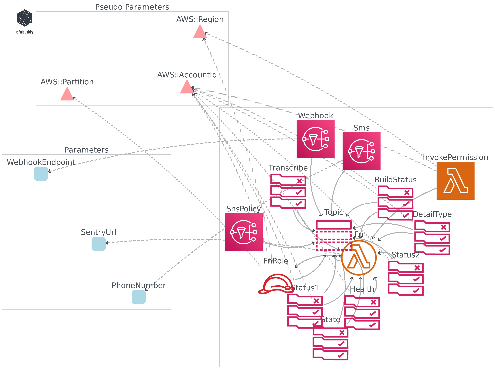

# aws-error-logger
Catch errors in dozens of AWS services

# Intro
There are many errors that can happen in the AWS Cloud. We want to know about them so that we can take the proper action.
This solution is a Cloudformation template that catches errors across of dozens of services.

Errors caught include:
- EC2 instance launch failures
- codebuild build project failures
- codepipeline deployment failures

but you also need to know when more obscure ones like `AWS Health Abuse Event` occur.

This is made possible by Cloudwatch Events which integrate with many services. This project sets up event rules that matches failure patterns recognised by Cloudwatch Events.

The target to receive notifications can be [Sentry](https://sentry.io/welcome/), SNS, or webhooks. This means that you can receive notifications by
- SMS
- Email
- any application that supports a webhook

# Example: when a build fails, target: Sentry

# Instructions
The project is deployed via the [AWS SAM CLI](https://github.com/awslabs/aws-sam-cli).

First, set some parameters in [samconfig.toml](samconfig.toml), like:
- s3 bucket that SAM will need
- aws profile
- parameter overrides like SentryUrl, phone number or webhook endpoint

## Deployment

If you use Docker, you may deploy with command:

`docker-compose up`

Otherwise, run `sam deploy --guided`

This will deploy the following template in us-east-1. Note that since Cloudwatch Events is a regional service, you need to repeat the deployment in all regions.

This depicts what will get deployed:

# Contributing
Did you find an error that should have been caught but is not? Raise an issue or send a pull request!

# Licence
Released under the simplified BSD Licence. See [LICENCE](/LICENCE) for details.
